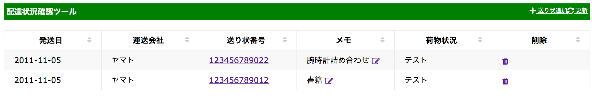

## 配達状況確認ツール

**日本の配送業者の送り状の配送状況をテーブルで一覧できるツールです｡**

+ 送り状番号を手動で登録し､一覧画面を更新する度に､
登録された送り状番号のステータスを更新します｡(未実装｡現時点では登録時のみ取得)
+ 現在はヤマトのみ対応｡将来的にはWebで公表している企業はすべて対応する予定です｡

### 実装予定機能
+ index画面の表示時に配達状況を更新する(フラグ0のみ)
+ httpエラー時のエラー処理

### 動作環境
+ 開発環境はMacOS sierra + VirtualBox + vagrant + CentOS 6.8
+ 動作確認はMacOS sierra +  google chrome で行いました｡

### API利用サイト
[宅配便の配達状況 API](http://thira.plavox.info/transport/api/)

[[WebAPI]ヤマト運輸の配送状況を確認するAPIを作ってみた](http://nanoappli.com/blog/archives/603)

### 参考サイト
[ドットインストール Laravel5入門 (全29回)](http://dotinstall.com/lessons/basic_laravel)

[ドットインストール JavaScriptでテーブルのソート機能を作ろう (全16回)](http://dotinstall.com/lessons/tablesort_js)

[ドットインストール ローカル開発環境の構築 [macOS編] (全14回)](http://dotinstall.com/lessons/basic_localdev_mac_v2)

[ドットインストール Bootstrap 3.0入門 (全18回))](http://dotinstall.com/lessons/basic_twitter_bootstrap_v4)
