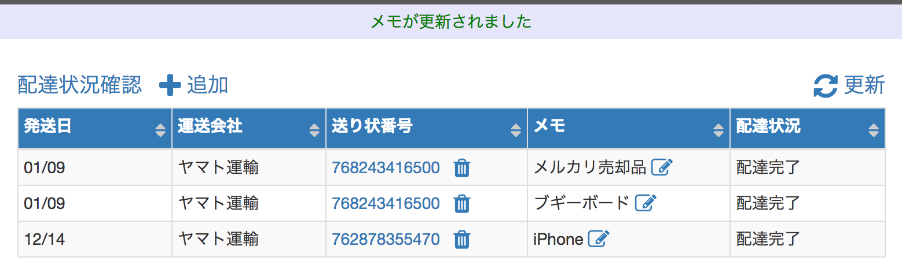

## 配達状況確認ツール

**送り状の配送状況をテーブルで一覧できるようにします｡**

+ 送り状番号を手動で登録し､一覧画面を更新する度に､
登録された送り状番号のステータスを更新します｡
+ 現在はヤマトのみ対応｡
将来的にはWebで公表している企業はすべて対応する予定です｡

### 動作環境
+ 開発環境はMacOS sierra + VirtualBox + vagrant + CentOS 6.8
+ 動作確認はMacOS sierra +  google chrome で行いました｡

### 参考サイト
[ドットインストール Laravel5入門 (全29回)](http://dotinstall.com/lessons/basic_laravel)

[ドットインストール JavaScriptでテーブルのソート機能を作ろう (全16回)](http://dotinstall.com/lessons/tablesort_js)

[ドットインストール ローカル開発環境の構築 [macOS編] (全14回)](http://dotinstall.com/lessons/basic_localdev_mac_v2)
### ドットインストールLaravel入門とのコマンドの相違点

#### 03 アプリケーションの設定をしていこう
create database check_delivery_status;

grant all on check_delivery_status.* to dbuser@localhost identified by 'hw8JUMe6';

#### 05 postsテーブルを作ってみよう

postテーブルでなくinvoiceテーブルを作成する

php artisan make:migration create_invoices_table --create=invoices

#### 07 Postモデルを作ってみよう

php artisan make:model Invoice

#### 13 PostsControllerを作ってみよう

php artisan make:controller InvoicesController
